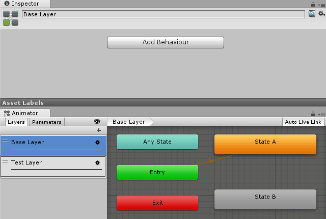

# animator-state-property-drawer [](http://mit-license.org)
Custom propery drawer to ease animator state selection in Unity editor. Allows to select animator state name value from dropdown list.



## How to use

Import `UnityForge` namespace and mark animator state name field with `AnimatorStateName` attribute:

```csharp
using UnityEngine;
using UnityForge;

public class AnimatorStateNameExample : MonoBehaviour
{
    [SerializeField, AnimatorStateName]
    private string stateName;

    private void Start()
    {
        var animator = GetComponent<Animator>();
        animator.Play(stateName);
    }
}
```

Currenlty property attribute works only for Animator component attached to the same game object.

## Caveats

Since layer index is [decoupled](https://docs.unity3d.com/ScriptReference/Animator.Play.html) from animator state name in Unity API, state name alone does not determine state and state index value should be managed separately. If only one animation layer is used, it's not the problem and `Play(string stateName)` overload can be used safely for fields using `AnimatorStateName` attribute.
